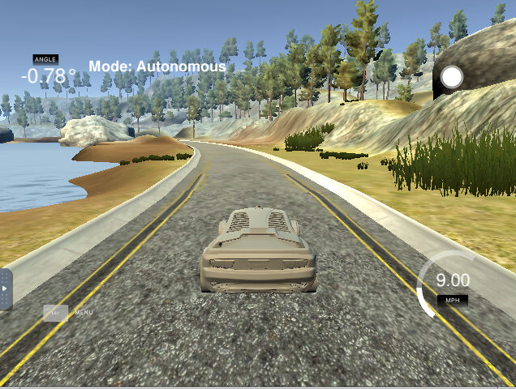
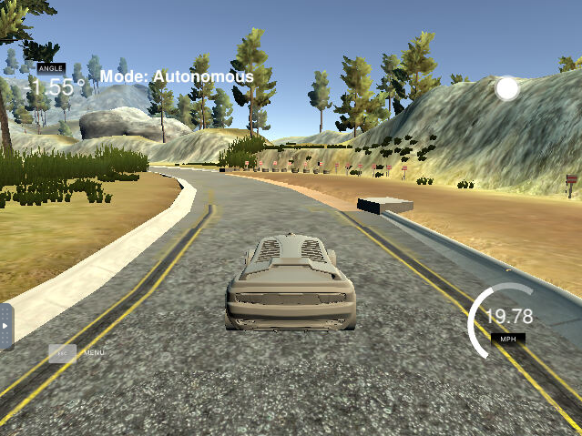
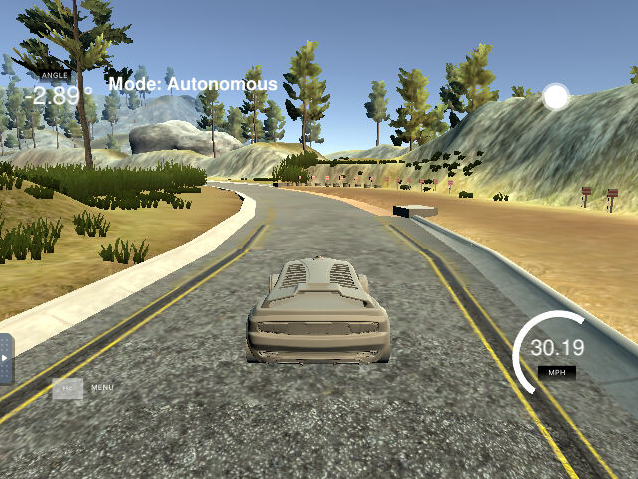

This is a project in Udacity Nanodegree for Self-driving car, forked from [CarND-Behaviorial-Cloning-P3](https://github.com/udacity/CarND-Behavioral-Cloning-P3).

# Behavioral Cloning Project

[](http://www.udacity.com/drive)

The goal of the project is to clone the behavior of a game car driver. My intention is to find a solution that can drive at different speeds.





For that, I have tried with 3 network structures, Nvidia's proposal, a reduced version of that and Lenet. Details of these networks are given below. 

For data augmentation, I have taken 3 actions:
1. Horizontally flipping the images according to project instructions
2. Using images from left and right cameras, again as suggested in the instructions
3. Shifting images with small steering commands to left and right
The images are cropped and normalized to [-1,+1] before being used. These steps are taken in a Keras generator, using Keras croppeing layer and in lambda layer.

For regularization, I have used a combination of dropout and batch regularization so that the output of regression becomes smoother.

These networks are trained once only with the data provided by Udacity and once with 3 data sets, where the two others were taken from Asshish Vivekanand's [post](https://github.com/aashishvanand/Behavioral-Cloning-P3}{Behavioral-Cloning-P3), who kindls shared his training data.

Training can be performed by the command
```
python model.py -m [desired_model] -d [data_directory]

```

The desired model can be one of three choices:
- nvidia
- reduced_nvidia
- lenet

The output of the training will be saved in an h5 file with the name model_desired_model.h5, which is to be read by drive.py.

The directory is assumed to include:
1. driving.log (a csv file)
2. a directory called IMG that includes all images
You can use wilde card in the name of the directory, but it must be quoted, i.e.

```
python model.py -d 'Data/*' -m reduced_nvidia
```
will train the model with all directories under ./Data that have a driving.log and an IMG/ directory and the result will be saved to 
```
model_reduced_nvidia.h5
```

The table below summarizes the results of the autonomous driving after training:

|  Network | Trained with | At 9 MPH | At 20 MPH | At 30 MPH | Saved in the directory      |
| ------      | ------ | ------ | ------ | ------ | ------ |
| Full Nvidia | One data set | OK | Wavy ride | Crashed |  nvidia_1data.C24-36-48-64-64.D100-50-10-1      |
| Half Nvidia | One data set | OK | Wavy ride | Crashed | nvidia_1data.C12-18-24-32-32.D50-25-10-1      |
| Lenet | One data set | Crashed | Crashed | Crashed | lenet_1data.C12-32.D120-84-1      |
| Full Nvidia | Three data sets | OK | OK | Bad, but not crashed | nvidia_1data.C24-36-48-64-64.D100-50-10-1      |
| Half Nvidia | Three data sets | OK |  OK | Bad, but not crashed  | nvidia_1data.C12-18-24-32-32.D50-25-10-1      |
| Lenet | Three data sets | OK | Crashed | Crashed | lenet_1data.C12-32.D120-84-1      |

Below each of directories above, you find the following files:
1. mp4 videos for all cases that have not crashed.
2. model_xx.h5, model output file, where xx is the model selected
3. stdout that shows the output of the program to the terminal
4. model structure as png-file
5. convergence history as png-file.
6. loss.csv that shows how the model has converged.

A detailed description of the steps together with some discussions can be found in the [project writeup](./writeup.pdf).

The tables below show the three network used, together with input processing as well as the regularization strategy.

### Original Nvidia network
```

    _________________________________________________________________
    Layer (type)                 Output Shape              Param #   
    =================================================================
    cropping2d_1 (Cropping2D)    (None, 50, 280, 3)        0         
    _________________________________________________________________
    lambda_1 (Lambda)            (None, 50, 280, 3)        0         
    _________________________________________________________________
    dropout_1 (Dropout)          (None, 50, 280, 3)        0         
    _________________________________________________________________
    conv2d_1 (Conv2D)            (None, 23, 138, 24)       1824      
    _________________________________________________________________
    conv2d_2 (Conv2D)            (None, 10, 67, 36)        21636     
    _________________________________________________________________
    conv2d_3 (Conv2D)            (None, 6, 63, 48)         43248     
    _________________________________________________________________
    conv2d_4 (Conv2D)            (None, 4, 61, 64)         27712     
    _________________________________________________________________
    conv2d_5 (Conv2D)            (None, 2, 59, 64)         36928     
    _________________________________________________________________
    flatten_1 (Flatten)          (None, 7552)              0         
    _________________________________________________________________
    dropout_2 (Dropout)          (None, 7552)              0         
    _________________________________________________________________
    dense_1 (Dense)              (None, 100)               755300    
    _________________________________________________________________
    activation_1 (Activation)    (None, 100)               0         
    _________________________________________________________________
    dropout_3 (Dropout)          (None, 100)               0         
    _________________________________________________________________
    dense_2 (Dense)              (None, 50)                5050      
    _________________________________________________________________
    batch_normalization_1 (Batch (None, 50)                200       
    _________________________________________________________________
    activation_2 (Activation)    (None, 50)                0         
    _________________________________________________________________
    dense_3 (Dense)              (None, 10)                510       
    _________________________________________________________________
    activation_3 (Activation)    (None, 10)                0         
    _________________________________________________________________
    dense_4 (Dense)              (None, 1)                 11        
    =================================================================
    Total params: 892,419
    Trainable params: 892,319
    Non-trainable params: 100
    _________________________________________________________________

```

### Reduced Nvidia network (half-Nvidia)
```

    _________________________________________________________________
    Layer (type)                 Output Shape              Param #   
    =================================================================
    cropping2d_1 (Cropping2D)    (None, 50, 280, 3)        0         
    _________________________________________________________________
    lambda_1 (Lambda)            (None, 50, 280, 3)        0         
    _________________________________________________________________
    dropout_1 (Dropout)          (None, 50, 280, 3)        0         
    _________________________________________________________________
    conv2d_1 (Conv2D)            (None, 23, 138, 12)       912       
    _________________________________________________________________
    conv2d_2 (Conv2D)            (None, 10, 67, 18)        5418      
    _________________________________________________________________
    conv2d_3 (Conv2D)            (None, 6, 63, 24)         10824     
    _________________________________________________________________
    conv2d_4 (Conv2D)            (None, 4, 61, 32)         6944      
    _________________________________________________________________
    conv2d_5 (Conv2D)            (None, 2, 59, 32)         9248      
    _________________________________________________________________
    flatten_1 (Flatten)          (None, 3776)              0         
    _________________________________________________________________
    dropout_2 (Dropout)          (None, 3776)              0         
    _________________________________________________________________
    dense_1 (Dense)              (None, 50)                188850    
    _________________________________________________________________
    activation_1 (Activation)    (None, 50)                0         
    _________________________________________________________________
    dropout_3 (Dropout)          (None, 50)                0         
    _________________________________________________________________
    dense_2 (Dense)              (None, 25)                1275      
    _________________________________________________________________
    batch_normalization_1 (Batch (None, 25)                100       
    _________________________________________________________________
    activation_2 (Activation)    (None, 25)                0         
    _________________________________________________________________
    dense_3 (Dense)              (None, 10)                260       
    _________________________________________________________________
    activation_3 (Activation)    (None, 10)                0         
    _________________________________________________________________
    dense_4 (Dense)              (None, 1)                 11        
    =================================================================
    Total params: 223,842
    Trainable params: 223,792
    Non-trainable params: 50
    _________________________________________________________________


```

### Lenet network with 32 filters at output of convolution layers
```

    _________________________________________________________________
    Layer (type)                 Output Shape              Param #   
    =================================================================
    cropping2d_1 (Cropping2D)    (None, 50, 280, 3)        0         
    _________________________________________________________________
    lambda_1 (Lambda)            (None, 50, 280, 3)        0         
    _________________________________________________________________
    dropout_1 (Dropout)          (None, 50, 280, 3)        0         
    _________________________________________________________________
    conv2d_1 (Conv2D)            (None, 48, 278, 12)       336       
    _________________________________________________________________
    max_pooling2d_1 (MaxPooling2 (None, 24, 139, 12)       0         
    _________________________________________________________________
    conv2d_2 (Conv2D)            (None, 22, 137, 32)       3488      
    _________________________________________________________________
    max_pooling2d_2 (MaxPooling2 (None, 11, 68, 32)        0         
    _________________________________________________________________
    flatten_1 (Flatten)          (None, 23936)             0         
    _________________________________________________________________
    dropout_2 (Dropout)          (None, 23936)             0         
    _________________________________________________________________
    dense_1 (Dense)              (None, 120)               2872440   
    _________________________________________________________________
    batch_normalization_1 (Batch (None, 120)               480       
    _________________________________________________________________
    dense_2 (Dense)              (None, 84)                10164     
    _________________________________________________________________
    dense_3 (Dense)              (None, 1)                 85        
    =================================================================
    Total params: 2,886,993
    Trainable params: 2,886,753
    Non-trainable params: 240
    _________________________________________________________________


```

### Reduced Nvidia network (half-Nvidia)

